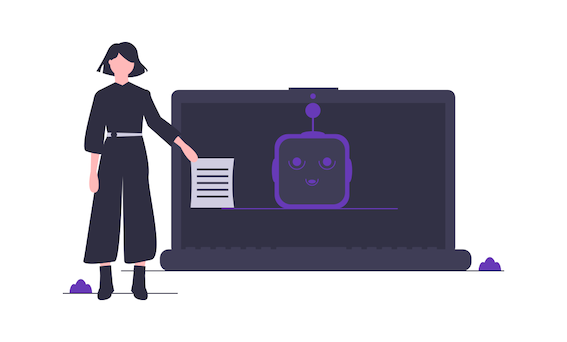
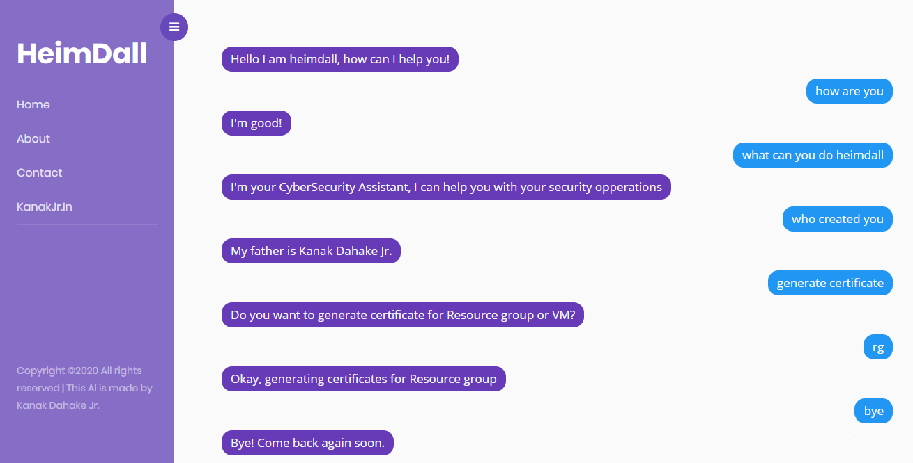

# Hello I'm HeimDall

*I'm your CyberSecurity Assistant, I can help you with your cybersecurity opperations.*

## Why a Chatbot?
Chatbots have the ability to help solve the talent and automation problems in our industry by dramatically simplifying complex tasks for security teams.

A Chatbot can provide following advantages:
- Ability to understand an analyst language and intent.
- Transform an L0 analyst into an l3 analyst.
- Detecting in-progress attacks.
- Ability to adapt over time.

## Screenshot

